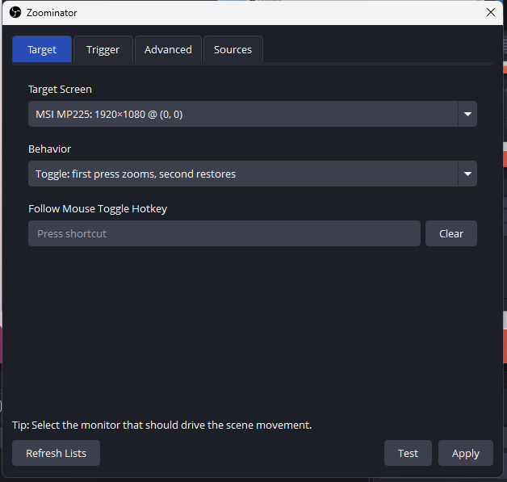
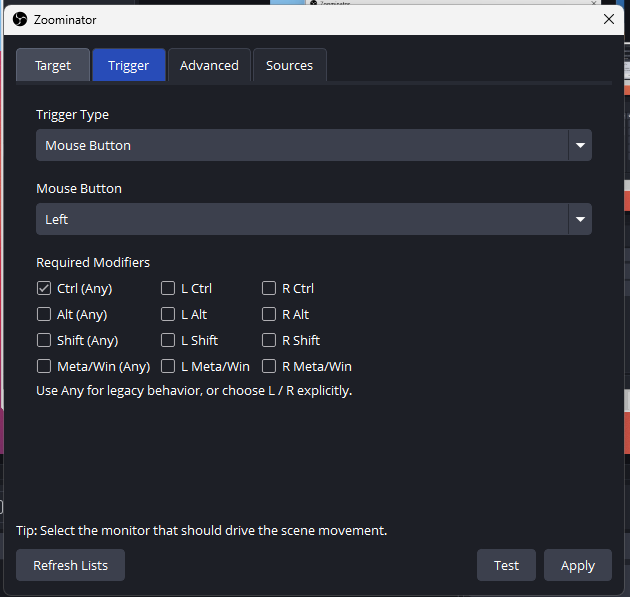
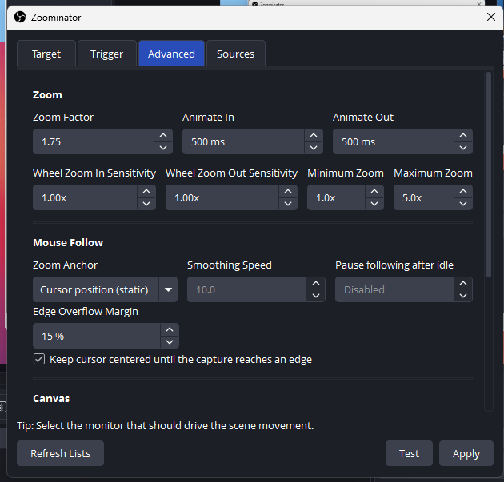
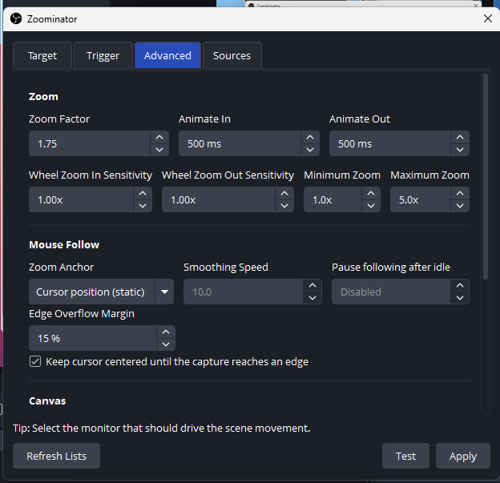
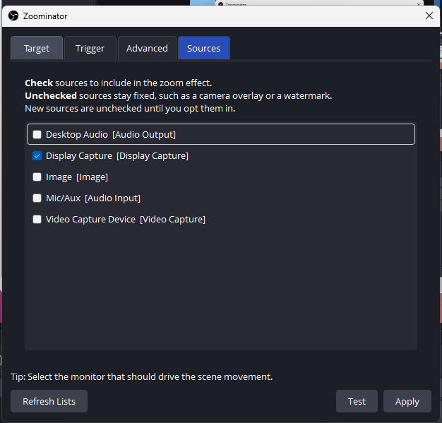
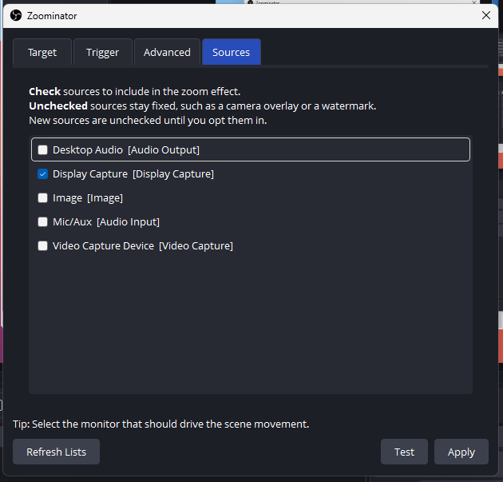

# FocusLens for OBS Studio 🔍

[](https://github.com/)
[](https://obsproject.com/)
[](LICENSE)
[](https://github.com/)

> **FocusLens** is a smart, dynamic screen zoom, cursor-following, and on-screen heads-up display (OSD) suite designed specifically for content creators, tutorial makers, educators, and streamers using OBS Studio.

---

## 🌟 Overview

When presenting tutorials, coding sessions, webinars, or game streams in OBS Studio, viewers frequently struggle to see small text, UI details, or menus. 

**FocusLens** solves this problem by giving you effortless, high-performance zooming capabilities directly inside OBS Studio, complete with automatic mouse tracking, cursor halo effects, and an exclusive **stealth OSD indicator** that alerts you when zoom is active without ever leaking into your stream or recording!

---

## 📸 Step-by-Step Walkthrough

Below is a visual guide on how to configure and use FocusLens:

### 1. Opening the Plugin
<p align="center"></p>
<p align="center"><em>Find FocusLens in the <b>Tools</b> menu of OBS Studio.</em></p>

### 2. Configuring Triggers
<p align="center"></p>
<p align="center"><em>Select your preferred hotkey or mouse button combination to activate the zoom.</em></p>

### 3. Adjusting Zoom Behavior
<p align="center"></p>
<p align="center"><em>Set the zoom multiplier and choose between "Hold" or "Toggle" modes.</em></p>

### 4. Selecting Sources
<p align="center"></p>
<p align="center"><em>Check the specific OBS sources (like Display Capture) you want to be magnified.</em></p>

### 5. The OSD Alert Badge
<p align="center"></p>
<p align="center"><em>The stealth "ZOOM ACTIVE" indicator appears on your screen (invisible to viewers).</em></p>

### 6. System Tray Companion
<p align="center"></p>
<p align="center"><em>Right-click the FocusLens tray icon to manually Sync, enable/disable the alert, or Exit.</em></p>

---

## ✨ Key Features

- 🎯 **Smooth Dynamic Zooming:** Instantly zoom in and out with smooth transitions on hotkeys or mouse buttons (e.g., `Ctrl + Left Click`).
- 🖱️ **Smart Mouse Following:** Naturally pans your zoomed view following your mouse movements in real-time.
- ⭕ **Interactive Click Halo:** Highlights mouse clicks with an animated halo ring, making it effortless for viewers to track what you click.
- 🛡️ **Stealth On-Screen Display (OSD):** Displays a sleek `🔍 ZOOM ACTIVE` badge on your screen so you never forget you are zoomed in. Powered by `WDA_EXCLUDEFROMCAPTURE`, meaning the alert is **100% invisible in your stream and recording**.
- 🔄 **Smart OBS Auto-Sync:** Zero resource wastage! When OBS Studio is closed, the companion background service hides its tray icon and detaches system hooks. The moment OBS opens, it seamlessly springs to life.
- 🚀 **1-Click Executable Installer:** No tedious manual copying of `.dll` or `.ini` files. Just double-click `FocusLensInstaller.exe` and you're ready to go!

---

## 📥 Installation

1. Go to the [**Releases**](https://github.com/) section on GitHub.
2. Download the latest **`FocusLensInstaller.exe`**.
3. Run **`FocusLensInstaller.exe`** (choose *Yes* when Windows requests Administrator privileges).
4. The installer will automatically locate your OBS Studio directory, deploy all plugin files, and configure the background alert service.
5. Launch **OBS Studio** and you are ready!

---

## 📖 How to Use (User Guide)

### 1. Opening Settings
1. Launch **OBS Studio**.
2. Go to the top menu bar and click **Tools** → **FocusLens...**.

### 2. Configuring Trigger Hotkey or Mouse Button
In the **Trigger** tab:
- **Keyboard Trigger:** Set a preferred hotkey (e.g., `F10` or `Ctrl + Z`).
- **Mouse Button Trigger:** Choose `Left`, `Right`, or `Middle` mouse button.
- **Modifiers:** Select required modifier keys (e.g., `Ctrl`, `Alt`, or `Shift`).
  - *Recommended combination:* `Ctrl (Any)` + `Mouse Button: Left` (Hold Ctrl and left click anywhere to zoom into that exact location).

### 3. Adjusting Zoom Behavior
In the **Target / Advanced** tab:
- **Behavior Mode:**
  - *Hold Mode:* Hold down your trigger to stay zoomed in; release to restore normal view.
  - *Toggle Mode:* Press once to zoom in; press again to zoom out.
- **Zoom Factor:** Set how deep the magnification is (default: `2.0x`).
- **Mouse Follow Sensitivity:** Fine-tune how smoothly the viewport follows your cursor.

### 4. Opting In / Out Sources
In the **Sources** tab:
- **Checked Sources:** Sources that will be enlarged during zoom (e.g., your Display Capture or Window Capture).
- **Unchecked Sources:** Sources that remain fixed and untouched (e.g., your webcam overlay, stream watermark, or animated borders).

### 5. Managing the OSD Zoom Alert
- When OBS Studio is active, a red magnifying glass icon appears in your Windows system tray.
- Right-click the tray icon to:
  - Toggle the on-screen alert on/off.
  - Resync the zoom state.
  - Exit the companion helper.

---

## 💻 Building from Source

If you want to build the installer and companion app yourself:

```powershell
# Clone the repository
git clone https://github.com/your-username/focus-lens-obs.git
cd focus-lens-obs

# Compile FocusLensOSD
C:\Windows\Microsoft.NET\Framework64\v4.0.30319\csc.exe /target:winexe /out:FocusLensOSD.exe /reference:System.Windows.Forms.dll /reference:System.Drawing.dll src/FocusLensOSD.cs

# Compile FocusLensInstaller
C:\Windows\Microsoft.NET\Framework64\v4.0.30319\csc.exe /target:exe /out:FocusLensInstaller.exe src/FocusLensInstaller.cs
```

---

## 📋 System Requirements

- **Operating System:** Windows 10 or Windows 11 (64-bit)
- **OBS Studio:** OBS Studio 28.0 or newer (64-bit)
- **.NET Framework:** 4.5+ (pre-installed on Windows 10/11)

---

## 🤝 Contributing

Contributions, issues, and feature requests are welcome!  
Feel free to check the [issues page](https://github.com/) to propose new features or report bugs.

---

## 📄 License

This project is licensed under the **MIT License** - see the [LICENSE](LICENSE) file for details.

---

## 👤 Author & Maintainer

**Saiful Islam**  
- Website: [saifulislam.net](https://saifulislam.net)  
- GitHub: [@saiful](https://github.com/)  
